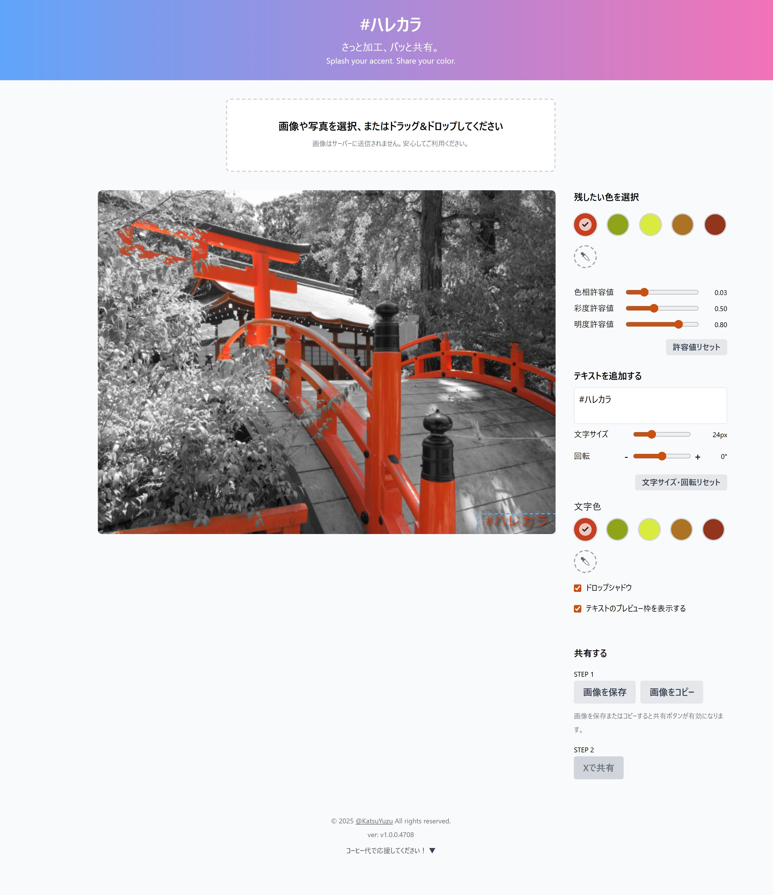
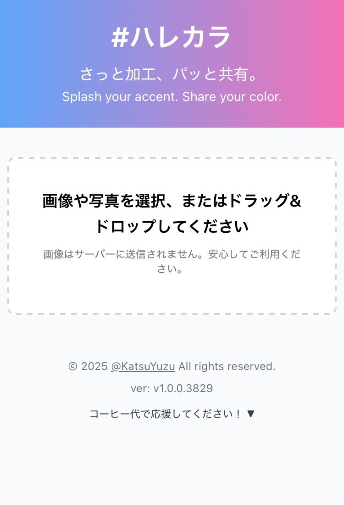
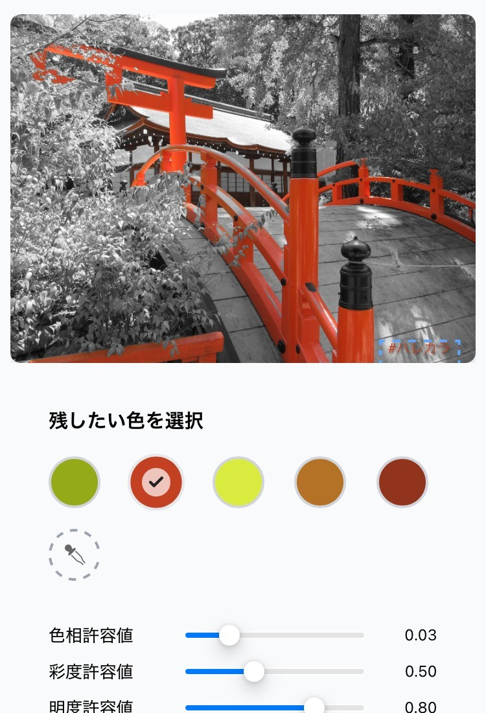

# #ハレカラ（#HareColor）

**さっと加工、パッと共有。**  
**Splash your accent. Share your color.**

[https://harecolor.github.io/HareColor/](https://harecolor.github.io/HareColor/)

  <h3>PC</h3>
  
  <h3>モバイル</h3>
  

    
    
  

## これはなに？

写真の中の「いちばん目立つ色」だけを残して、まわりをふわっと白黒に。
それだけで、CMのワンシーンみたいに主役がグッと引き立つ一枚になります。

むずかしい操作はいりません。写真を選ぶと、いい感じの色を自動で選んで加工。気に入らなければ、あとから少し直すだけ。
写真はあなたのブラウザの中だけで加工されるので、どこにも送られません。広告もログインもなし。思いついたときに、気軽にどうぞ。

## できること

- 写真をドラッグ＆ドロップ、またはタップで選ぶだけ
- 目立つ色を自動で見つけて、その色だけ残す（まわりは白黒に）
- 別の色を残したいときは、写真のその場所をタップ
- 色の強さや白黒の明るさは、スライダーでかんたん調整
- 細かく直したいときは、残す場所・白黒にする場所を指でなぞって修正
- パレットやスポイトから、好きな色を自分で選ぶことも
- 好きな文字（ハッシュタグや名前）を入れて、自由に配置
- できあがった画像は、保存・コピー・Xでそのままシェア

## 使ってみる

1. サイトを開いて、写真を選ぶ
2. 自動で色が残った加工結果が出ます
3. 気になったら、色の強さや白黒の明るさをちょっと調整
4. 別の色を残したいときは、写真のその場所をタップ
5. もっと細かく直したいときは、指でなぞって修正
6. 文字を入れたり、画像を保存してSNSへ

## 安心して使えます

- 写真はどこにも送られません。加工はぜんぶブラウザの中だけ
- 広告なし・アカウント登録なし
- 設定は自動で覚えておくので、次に開いてもそのまま

## こんなときに

- ゲームや日常のスクショを、SNSでちょっと映えさせたい
- むずかしい画像編集アプリは使いたくない
- 一色だけ際立つ、おしゃれな写真をつくりたい
- 変な広告や、写真がどこかに送られるのがイヤ

## 更新履歴

### v1.2（2026-08）

- 文字入れに、最近使ったテキストを最大５件まで覚えて、ワンタップで選べるように
- スポイトで色を選ぶとき、マウス位置を十字で示し、その周りを拡大するルーペをカーソルに重ならない位置に表示
- 「色に沿う」ブラシでも、なぞる色を拡大して確かめられるルーペを追加
- スポイトはもう一度ボタンを押すと解除できるように

### v1.1（2026-08）

- 写真を選ぶだけで、いちばん目立つ色を自動で選んで残せるようになりました
- 残す場所・白黒にする場所を、指でなぞって直せる「ブラシで塗り分け」を追加
- 色の強さや白黒の明るさ・コントラスト、境目のなじみをスライダーで調整できるように
- 最初に選ばれる色を見直して、いちばん映える色がすぐ選ばれるように

### v1.0

- 最初のリリース
- 選んだ色だけ残して、まわりを白黒にする加工
- パレット・スポイト・色の細かな調整で、残す色を選択
- 文字入れ、画像の保存・コピー・Xシェア
- 日本語／英語に対応

## お問い合わせ・開発者情報

- 開発者X: [@KatsuYuzu](https://x.com/KatsuYuzu)
- サービスに関するご意見・ご要望はXまで

※ 一部アイコンは「[ICOON MONO](https://icooon-mono.com/)」様より利用しています。

---

ご利用ありがとうございます。
「#ハレカラ」で、あなたらしい一枚をぜひSNSでシェアしてください。
